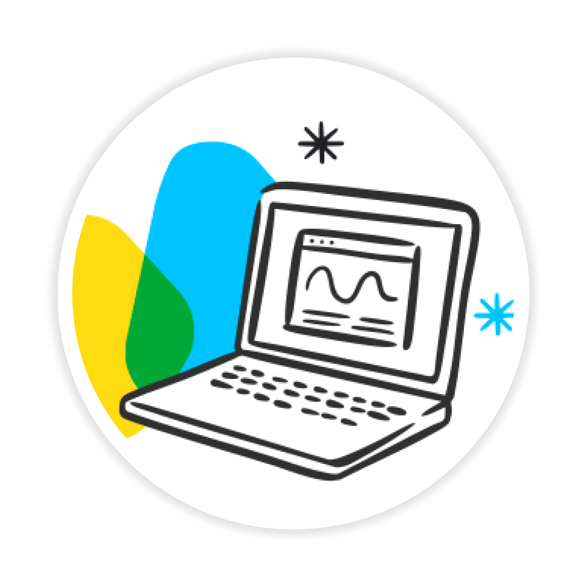

# 🤖 5-Day AI Agents: Intensive Vibe Coding Course (Google) — My Learning Notes

> Personal study notes and key takeaways from Kaggle's **"5-Day AI Agents: Intensive Vibe Coding Course with Google"**, covering agentic development with Google Antigravity, ADK 2.0, MCP, and production deployment on Google Cloud.

## 📌 About

This repo documents what I learned while completing Google's 5-Day AI Agents course on Kaggle. It covers the full lifecycle of building AI agents — from rapid prototyping to secure, production-grade deployment.

## 🗂️ Course Structure & What I Learned

### Day 1 — Foundations: Google Antigravity
- Antigravity's 4 components: standalone app, IDE, CLI, SDK
- Projects, Conversations, and security/permission presets
- **Artifacts** as a "trust layer" — Implementation Plans, Task Lists, Walkthroughs for reviewing agent work before it executes
- **Skills** — progressive-disclosure instruction packages that load only when relevant, avoiding context bloat

### Day 2 — Rapid Prototyping (Vibe Coding)
- Building apps via natural-language prompts in Google AI Studio
- Deploying prototypes to **Cloud Run** with one click

### Day 3 — Grounding Agents with MCP
- Model Context Protocol (MCP) fundamentals
- Connecting to Google's **Developer Knowledge MCP server** to reduce hallucinations by grounding agents in live documentation

### Day 4 — Building Agents Securely (ADK 2.0 + Agents CLI)
- Scaffolding agents with `agents-cli`
- **Shift-left security**: STRIDE threat modeling, Semgrep static analysis, pre-commit hooks, and Antigravity Agent Hooks
- Test-driven development (TDD) for agents — asserting on outcomes, not internal calls
- ADK 2.0 concepts: `Workflow`, `Edge`, `Node`, `LlmAgent`, `Context`, `Event`

### Day 5 — Production Deployment
- Deploying agents to **Agent Runtime** (managed sessions, sandboxing, observability)
- Event-driven architecture with **Pub/Sub** (OIDC push subscriptions, dead-letter topics)
- Human-in-the-loop workflows using `RequestInput`
- Building a manager-approval dashboard with FastAPI + Cloud Run
- Observability via Cloud Trace, Cloud Logging, and BigQuery

## 🛠️ Tools & Tech Covered
`Google Antigravity` · `Antigravity CLI` · `Agents CLI` · `ADK 2.0` · `MCP` · `Google AI Studio` · `Cloud Run` · `Agent Runtime` · `Pub/Sub` · `Semgrep` · `pre-commit` · `pytest` · `uv`

## 📖 Key Concepts Glossary
| Term | Meaning |
|------|---------|
| Vibe Coding | Describing what you want in plain English; the AI agent builds it |
| Artifact | Reviewable proof-of-work doc (plan, diff, walkthrough) for trust |
| MCP | Open standard for AI models to call tools on external servers |
| ADK | Google's framework for graph-based agent workflows |
| STRIDE | 6-category security threat modeling framework |
| Agent Runtime | Google Cloud's managed hosting for production agents |

*(Full glossary in my detailed notes — see `/notes` folder)*

## 🏆 Certification
✅ Earned the **5-Day AI Agents: Intensive Vibe Coding Course With Google** badge — Kaggle, June 2026.

## 🔗 Resources
- Course: [Kaggle — 5-Day AI Agents](https://www.kaggle.com/)
- Google Antigravity: [antigravity.google](https://antigravity.google)
- Google AI Studio: [aistudio.google.com](https://aistudio.google.com)

---
*Notes compiled for personal learning and reference. Not affiliated with or endorsed by Google/Kaggle.*
